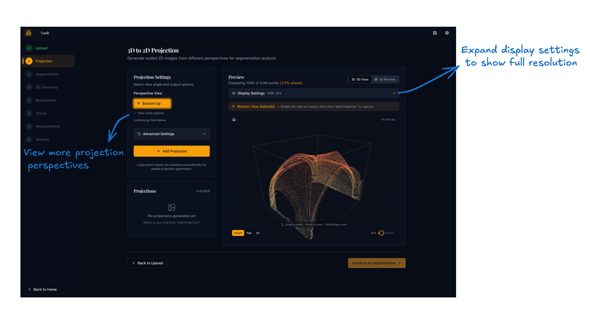

# Step 2: Generate Projection

## Purpose

Convert the loaded 3D scan into a 2D orthographic image that exposes the vault surface for segmentation and geometry work.

## How projection works

Points are accumulated onto the image plane using a **1D Gaussian splat**: each 3D point contributes intensity to its projected pixel weighted by a Gaussian function of its distance from the projection focal plane along the view axis.[^1] Summing these weighted contributions across all points produces a smooth density image that fills small gaps between neighbouring points and reduces aliasing, giving clearer rib definition than a simple point-drop or max-depth render.

[^1]: Gaussian splatting accumulates point contributions via a kernel function rather than hard per-pixel binning; the foundational formulation is given in Westover, L.A., "Footprint Evaluation for Volume Rendering", *ACM SIGGRAPH Computer Graphics* 24(4), 1990, 245–252.

## Choosing a perspective

Vault Analyser supports multiple orthographic viewpoints. The choice depends on which surface you are analysing:

| Perspective | Use when |
|-------------|----------|
| **Bottom (intrados)** | Analysing the underside of the vault — the usual starting point for rib geometry |
| **Top (extrados)** | Analysing the vault's upper surface |
| **North / South / East / West** | Analysing a particular elevation or section if the vault is not viewed from directly below |

For most rib analysis, start with the **Bottom Up** projection.

## What you do here

1. Select a projection perspective from the controls.
2. Set the resolution and any projection settings such as Gaussian spread if needed. Higher detail gives clearer outputs but takes longer.
3. Click **Generate Projection** and wait for the image to appear in the preview panel.
4. Inspect the result. Ribs and bosses should be readable enough for segmentation.
5. If needed, adjust the settings or try another viewpoint and generate again.
6. Keep at least one projection that you are confident using for Step 3.

## Interface controls

| Control | What it does |
|---------|-------------|
| Perspective selector | Chooses the projection axis |
| Resolution / scale | Sets image size and output detail |
| Generate button | Triggers the projection computation |
| Preview panel | Displays the resulting 2D image |

{ width="800" .center }

The **Bottom Up** perspective is selected by default. Click **View more options** beneath the perspective selector to reveal the remaining viewpoints (Top Down, North, South, East, West). The **Display Settings** bar in the preview panel is collapsed by default; expand it to adjust how many points are loaded for the interactive 3D preview and to reload the point cloud at a different density.

## What to check before moving on

- The main rib pattern is visible.
- Boss locations can be identified.
- The image is not obviously clipped, blurred, or misleading.

## Expected result

At least one usable saved projection ready for segmentation in Step 3.
