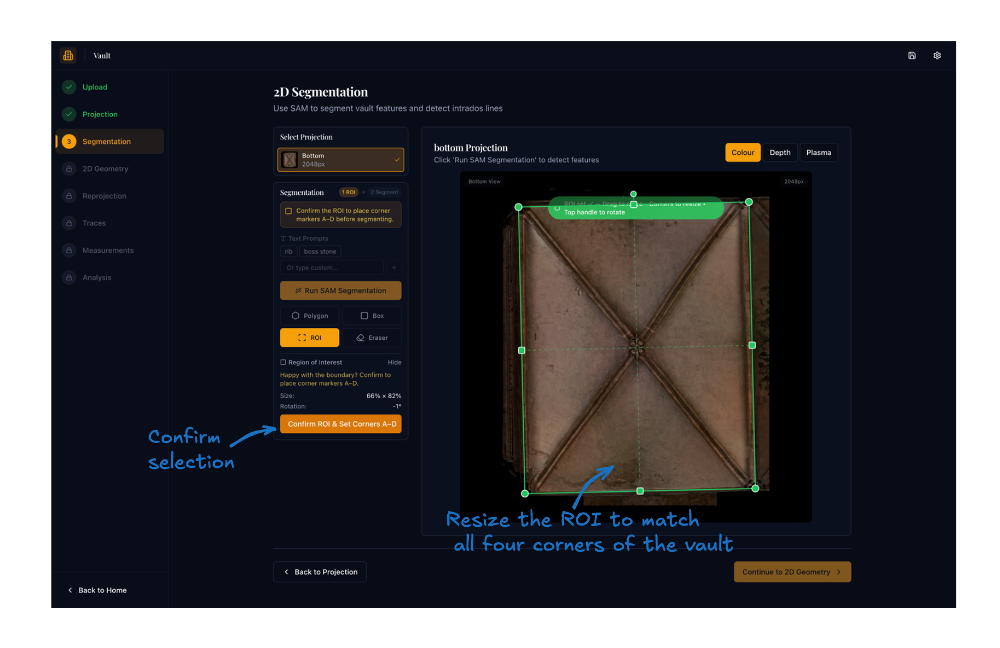
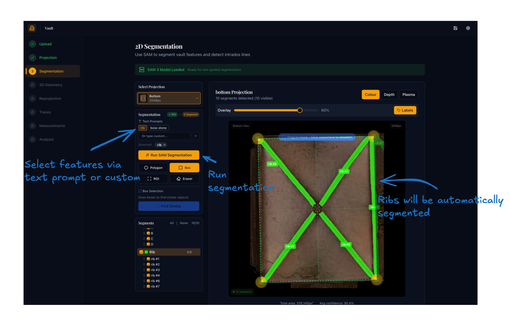
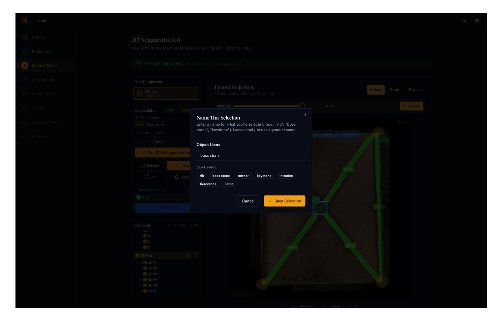
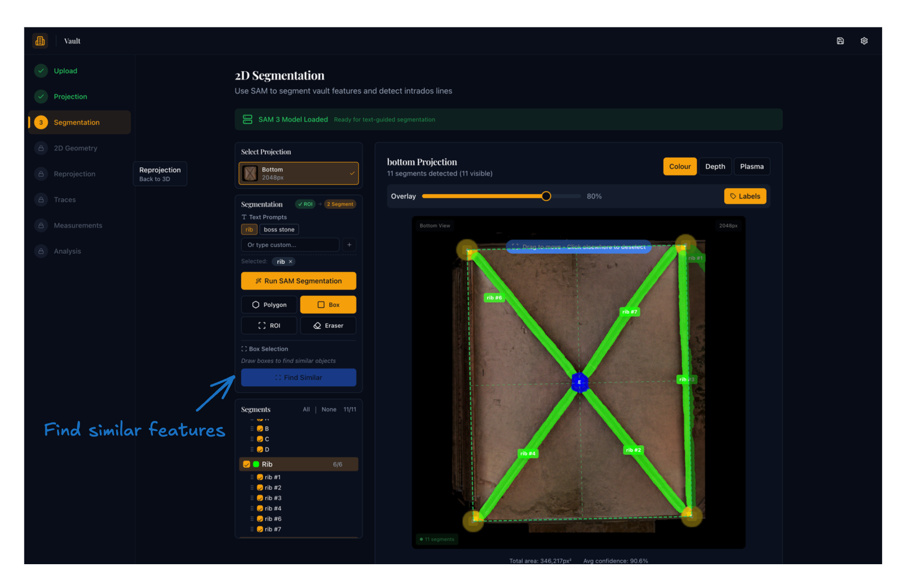
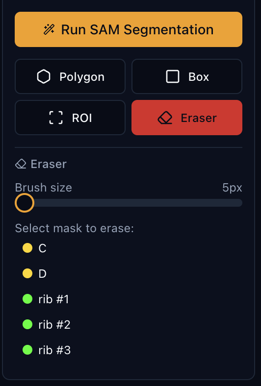

# Step 3: Segmentation

## Purpose

Identify and label the architectural features on the projection image — ribs, boss stones, corners, and any other elements you need — so that later stages work from clean, named masks rather than raw imagery.

## How segmentation works

The application uses **SAM 3** (Segment Anything with Concepts) to turn user-drawn prompts into feature masks.[^1] You direct the model by drawing bounding boxes or polygons around the features you want, optionally guiding it further with text labels. The model returns one or more candidate masks per prompt; you keep what is useful and discard or refine the rest.

[^1]: SAM 3 extends the prompt-driven segmentation framework with concept-level understanding, enabling the model to associate masks with semantic categories without task-specific retraining. See Carion et al., "SAM 3: Segment Anything with Concepts", [arXiv:2511.16719](https://arxiv.org/abs/2511.16719), 2025.

---

## Required order of operations

Segmentation in this step follows a fixed two-stage sequence:

```
1  ROI  →  Confirm  →  2  Segment
```

The workflow progress indicator at the top of the **Segmentation** panel shows which stage you are on. Segmentation tools are locked until the ROI has been confirmed.

---

## Stage 1 — Define the Region of Interest

The ROI is a rotatable rectangle that marks the boundary of the vault bay you are analysing. Confirming it does two things: it places four labelled corner markers (A–D) that become reference points for Step 4, and it unlocks the segmentation tools.

### Drawing the ROI

1. Select the **ROI** tool from the four-tool grid (it is selected by default when the page opens).
2. Click and drag on the projection image to draw the rectangle.
3. Resize and position it so that all **four corners of the ROI align precisely with the four corners of the vault bay**:
   - **Drag the interior** to move the whole rectangle.
   - **Drag a corner or edge handle** to resize.
   - **Drag the rotation handle** (arc above the top edge) to rotate the rectangle to align with the bay axis.

The ROI panel shows the current size as a percentage of the image and the rotation angle. If masks are already present, it also shows how many fall inside versus outside the boundary.

{ width="800" .center }

The green rectangle should fit tightly to the vault boundary. Corner handle points are visible at each corner — drag them individually to fine-tune the fit before confirming.

!!! tip
    Rotate the ROI to match the axis of the bay rather than forcing a straight rectangle onto a skewed scan. Even a few degrees of correction can significantly improve the quality of the geometry analysis in Step 4.

### Confirming the ROI

Once you are satisfied with the boundary:

1. Click **Confirm ROI & Set Corners A–D** in the ROI panel.
2. Four gold dot markers labelled **A**, **B**, **C**, **D** (top-left, top-right, bottom-right, bottom-left) are placed at the exact corner positions as mask entries.
3. The ROI status pill changes to **✓ ROI** and the segmentation tools become active.

If you need to adjust the boundary after confirming, switch back to the ROI tool and redraw. The confirmation clears automatically when the rectangle is moved or resized and must be re-confirmed before segmenting.

### Removing masks outside the ROI

After segmenting, any masks that fall outside the bay boundary can be removed:

- In the ROI panel (with the ROI tool active), click **Remove N Outside ROI** if the button is visible.
- The backend classifies every mask by pixel overlap rather than just bounding-box centre, so masks that touch the ROI edge are retained.
- This operation permanently deletes the outside masks from the project file. Review the list before proceeding.

---

## Stage 2 — Segmenting features

### Choosing what to segment

For rib-geometry analysis you need at minimum:

- **Rib** masks covering the visible rib surfaces.
- **Boss stone** masks for the boss keystones at rib intersections.

The corner markers A–D are placed automatically during ROI confirmation; you do not need to draw them separately.

### Segmentation tools

Four tools are available in a 2×2 grid below the SAM button. Switch between them with a single click.

| Tool | Icon | Use for |
|------|------|---------|
| **Polygon** | Hexagon | Drawing closed outlines around features for guided segmentation |
| **Box** | Square | Drawing bounding boxes as positive or negative prompts |
| **ROI** | Scan frame | Adjusting the vault bay boundary (Stage 1) |
| **Eraser** | Eraser | Removing unwanted portions of an existing mask |

The Polygon, Box, and Eraser tools are disabled until the ROI is confirmed.

---

### Text prompts

Text prompts tell SAM what kind of feature you are looking for before running segmentation. They act as a semantic guide on top of the spatial prompt.

**Quick presets** — click a preset button to add it immediately:

| Preset | Use for |
|--------|---------|
| `rib` | Main vault ribs |
| `boss stone` | Keystone bosses at rib junctions |

**Custom prompts** — type into the prompt field and press **Enter** or click **+** to add any term not covered by the presets. If a standard label like `rib` or `intrados` gives poor results, try alternative descriptions such as:

- `soffit` or `vault ceiling` — alternative terms for the intrados surface
- `arch line` or `vault rib line` — can work better when ribs are narrow or faint
- `keystone` — for prominent decorative keystones not classified as boss stones
- `tierceron` or `lierne` — for secondary and linking ribs in more complex vaults

Active prompts appear as tags below the input. Click **×** on a tag to remove it. Multiple prompts can be active at once; SAM will segment instances of each type in a single pass.

{ width="800" .center }

With `rib` selected as the prompt, clicking **Run SAM Segmentation** returns masks for all detected rib instances across the full image automatically.

!!! note
    When using the **Box** or **Polygon** tools to run segmentation, only the name assigned to that box or polygon is used as the text prompt — not the active text prompt list. This allows you to run multiple targeted segmentations in one pass without changing the global prompt list.

### Running SAM segmentation

1. Add at least one text prompt (or draw a box/polygon — see below).
2. Click **Run SAM Segmentation**.
3. The model processes the full image and returns masks for all detected instances.
4. New masks are merged into the existing set — see [Duplicate handling](#duplicate-handling) below.
5. Masks outside the ROI are automatically removed after each run.

---

### Box prompts (Find Similar)

Use box prompts when you want to point the model at a specific visible instance and have it find all similar features across the image. This is particularly effective for boss stones, which can be hard to describe by text alone.

1. Select the **Box** tool.
2. Drag a rectangle around a clear example of the target feature on the canvas.
3. A **Name This Selection** dialog appears — enter a label (e.g. `boss stone`, `rib`) or click one of the quick-select options.

{ width="800" .center }

4. Use the **+/−** toggle on a drawn box to mark it as a positive prompt (include) or negative prompt (exclude). Negative prompts tell the model what to avoid.
5. Add as many boxes as needed across the image.
6. Click **Find Similar** to run segmentation using all drawn boxes simultaneously.

{ width="800" .center }

The box name becomes the class label for all masks produced by that prompt. Draw one clear positive box on the best visible example, then add negative boxes on areas to avoid (shadows, adjacent features of a similar shape) for cleaner results.

The **Polygon** tool works identically but lets you draw a freeform closed outline instead of a rectangle — useful for irregularly shaped features or when you need to exclude a specific sub-region.

---

### Eraser tool

Use the eraser to clean up the edges of an existing mask without deleting it entirely — useful when SAM has spilled over onto adjacent masonry or included a shadow.

1. Select the **Eraser** tool (highlighted red when active).
2. Set the **Brush size** using the slider in the eraser panel.
3. Select the mask you want to edit from the list in the panel.
4. Paint over the canvas to remove those pixels from the selected mask in real time.

{ width="400" .center }

Only visible masks appear in the eraser's selection list. To erase a mask that is hidden, make it visible first using the checkbox in the Segments panel.

---

## Duplicate handling

Each time new masks are returned from SAM they are merged with the existing masks using these rules:

- **IoU threshold of 0.35.** If a new mask overlaps an existing mask by more than 35% of their combined area, they are considered duplicates.
- **Quality replacement.** If the new mask has a higher predicted IoU quality score than the existing one, the existing mask is replaced. If the new mask is lower quality, it is discarded.
- **No false duplicates.** Masks that only partially overlap (below the threshold) are kept as separate instances.

This means repeated segmentation runs progressively improve mask quality rather than accumulating duplicates.

---

## Mask management

### Overlay controls

At the top of the image panel:

- **Opacity slider** — adjusts how strongly the coloured masks are blended over the projection image.
- **Labels toggle** — shows or hides the short label identifier on each mask in the canvas overlay.

### Segments panel

All current masks are listed below the tool card, grouped by feature type. Within each group:

- **Show/hide group** — the group header checkbox toggles all masks in the group at once.
- **Show/hide individual mask** — the checkbox next to each mask entry.
- **Rename mask** — double-click the label or click the pencil icon; press **Enter** to save or **Escape** to cancel.
- **Delete mask** — click the trash icon next to the mask entry.
- **Delete whole group** — click the trash icon on the group header row.
- **Reorder** — drag masks within the list using the grip handle on the left.

Changes to the mask list are saved to the project file immediately.

### Mask labelling

Masks are automatically labelled when created:

- **Corner markers** receive labels A, B, C, D (always the first four alphabetical slots).
- **Boss stones** receive labels E, F, G, … continuing after the corners.
- **All other feature types** (ribs, etc.) receive sequential numeric labels: `rib #1`, `rib #2`, …

The short suffix letter or number is shown on the canvas overlay (e.g. `E` rather than `boss stone E`) to keep the image uncluttered.

---

## What to check before moving on

- The ROI tightly encloses the vault bay, with all four corner markers (A–D) visible and correctly positioned.
- Rib masks cover the main rib surfaces without large gaps or excessive spill onto adjacent masonry.
- Boss stones are marked clearly at the main rib intersections.
- No major masks are missing or obviously wrong.
- Saving happens automatically when masks are added or deleted; click **Continue to Step 4** to proceed.

## Expected result

A set of saved segmentation masks — ribs, boss stones, and corner markers — ready for the 2D geometry analysis in Step 4.
