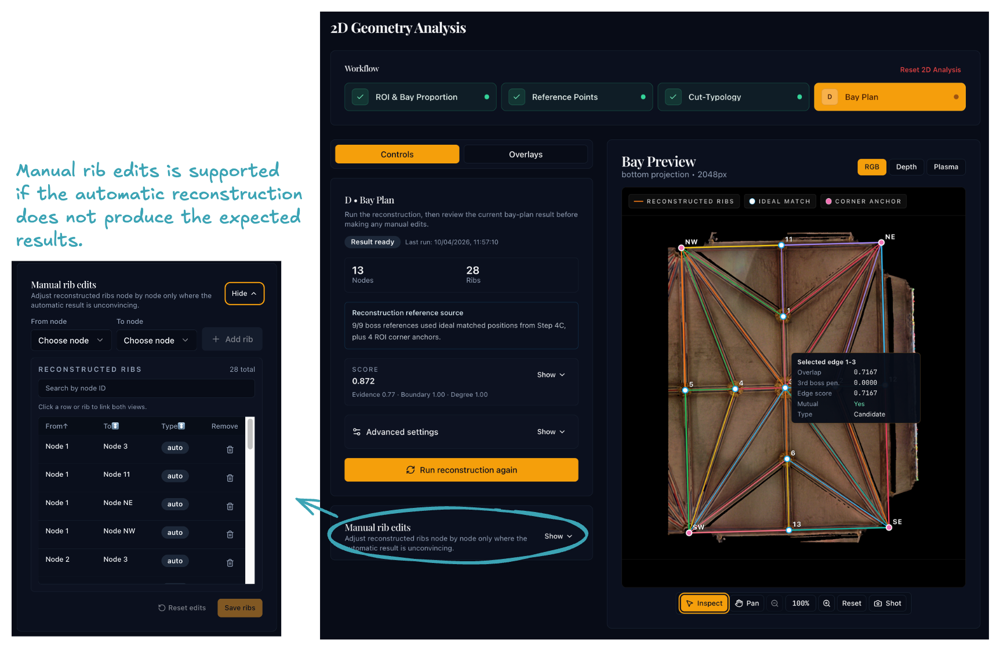

# Step 4D: Bay-Plan Reconstruction

## Purpose

This final Step 4 sub-stage reconstructs the **bay plan** from the ROI, reference points, matching results, and segmentation masks.

## Workflow

{ width="800" .center }

### 1. Review the reconstruction settings

Start with the default settings. Tune the advanced parameters below only if the defaults do not produce satisfactory results. 

| Parameter | Description |
|-----------|-------------|
| Reconstruction mode | `angular_nearest` (default) or `delaunay` |
| Angle tolerance | Minimum angular separation between candidate directions per node |
| Candidate min score | Rib-mask overlap threshold for accepting a candidate edge |
| Candidate max distance | Maximum (u, v) distance between nodes for a candidate edge |
| Corridor width | Pixel width of the rib-mask overlap corridor |
| Min / max node degree | Degree bounds for the graph-selection and repair passes |
| Boundary tolerance | (u, v) margin for classifying a node as lying on the ROI boundary |
| Enforce planarity | Whether to reject edges that would cross existing selected edges |

### 2. Run reconstruction

The backend loads the saved node points from sub-stage 4B (preferring ideal template positions from 4C where available) and the grouped rib-segmentation mask. It then:

1. **Generates candidate edges** — for each node, finds nearby neighbours in distinct directions and scores each edge by rib-mask overlap.[^1] An alternative Delaunay mode is available when mask evidence is weak.[^2]
2. **Selects the final graph** — adds boundary edges first, then greedily adds candidates in score order (subject to degree limits and optional planarity), and repairs any under-connected nodes.
3. **Scores the result** on four weighted components:

| Component | Weight | Description |
|-----------|--------|-------------|
| Edge evidence | 55 % | Mean rib-mask overlap score of non-boundary edges |
| Boundary coverage | 20 % | Proportion of mandatory boundary edges present |
| Degree satisfaction | 15 % | Proportion of nodes within the degree bounds |
| Mutual support | 10 % | Proportion of edges confirmed in both directions |

### 3. Inspect and edit

- Compare the graph against the underlying projection and masks using the layer toggles.
- Add missing edges or remove wrong ones manually. Manual edits are saved alongside the computed graph.

If the graph has obvious errors, try the following before editing manually:

- Lower **candidate min score** to recover missing edges in areas with weak rib-mask evidence.
- Raise **max node degree** if key junctions are losing edges.
- Lower **candidate max distance** if the graph connects nodes across the bay that should not be linked.
- Switch **reconstruction mode** to `delaunay` for comparison — if it produces a cleaner graph, the rib-mask evidence may be too noisy for angular-nearest.

[^1]: Related reference: Steger, C., "An Unbiased Detector of Curvilinear Structures", *IEEE Transactions on Pattern Analysis and Machine Intelligence* 20(2), 1998, 113–125.

[^2]: Related reference: Shewchuk, J.R., "Triangle: Engineering a 2D Quality Mesh Generator and Delaunay Triangulator", *Applied Computational Geometry*, Springer, 1996, 203–222.

## Why it matters

The bay plan is the main 2D output: Step 5 reprojects it into three-dimensional space. Errors here — missing ribs, false connections, misplaced nodes — propagate into all downstream 3D geometry.

## Before moving on

Before leaving Step 4 you should have:

- a bay plan whose edges match the visible rib pattern
- any necessary manual corrections applied
- a saved result ready for Step 5
