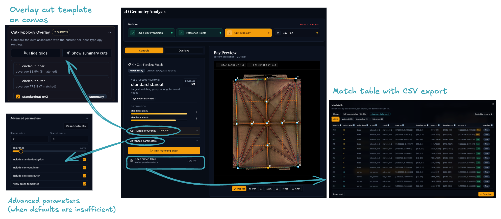

# Step 4C: Cut-Typology Matching

## Purpose

This sub-stage identifies which **geometric template** best explains the boss positions inside the bay. A good match regularises the plan and steadies the reconstruction in 4D; a poor one can push it towards the wrong geometry.

## Background: starcuts and circlecuts

Medieval vault designers set out rib plans by drawing construction lines through a starting figure inscribed in the rectangular bay. Where those lines crossed, they fixed the bosses and the ends of the ribs.[^1] Vault Analyser tests several template families from this tradition:

**Starcut (standard grid)**
:   An *n* by *n* regular grid that divides the bay into equal fractions on both axes. The grid crossings are where designers placed tierceron and lierne junctions. The app tries divisors from *n* = 2 to *n* = 6 by default.

**Inner circlecut**
:   A circle centred on the bay whose radius is half the longest side, so it touches the midpoints of the two longer edges. Its crossings with the bay's bisectors and corner lines give keypoints that are not simple fractions.

**Outer circlecut**
:   The same idea, but the circle passes through all four corners (radius is half the diagonal), giving a different set of crossings.

[^1]: For a detailed account of starcut geometry and its application in medieval vaulting see [Plans — Tracing the Past](https://www.tracingthepast.org.uk/2021/04/07/designing_plans/).

## Workflow

{ width="800" .center }

### 1. Review the matching settings

Start with the defaults. Adjust the advanced parameters below only if the defaults do not give a good result.

| Parameter | Default | Description |
|-----------|---------|-------------|
| Starcut Min *n* | 2 | Lowest standard-grid divisor to try |
| Starcut Max *n* | 6 | Highest standard-grid divisor to try. Most documented medieval vault patterns use *n* ≤ 6, so raise it to 7 or 8 only if a pattern needs it, and tighten the tolerance to match |
| Include starcut | On | Try the standard *n* by *n* grids |
| Include circlecut inner | On | Try the inner circle |
| Include circlecut outer | On | Try the outer circle |
| Ratio tolerance | 0.03 | How close a coordinate must sit to a template line to count as matched, in normalised bay units. The default keeps each accepted point on a single cut line; if you raise Starcut Max, tighten this too |

### 2. Run matching

Click **Run matching**. The app fits each enabled template to your bosses and labels every boss:

- **Matched:** both axes line up with a template cut line.
- **Partial:** only one axis lines up; the other keeps its measured position.
- **Unmatched:** neither axis lines up.

It then ranks the templates by how many bosses they explain, preferring the simpler figure when two templates tie (medieval designers reached for the simplest figure that fits). The leading template and a per-boss match table are saved for the next stage, and each matched boss gets an idealised position that reconstruction can use.

!!! info "How it works"
    For the full matching algorithm, the ranking key, the tolerance maths, and the files written, see [Appendix A](../../appendix/cut-typology-algorithm.md).

### 3. Inspect the result

Check the result in three places, then decide whether to continue.

**On the canvas**

- Compare the template overlays against the boss positions.
- Hover or focus a template row to preview that grid without turning it on permanently; previews carry a **Preview** chip.
- Click a boss to pin a magenta guide through it, aligned to the bay's width and height axes. Click it again, or click empty canvas, to clear it.

**In the summary pill** (above the table)

- Shows the **Full**, **Partial**, and **Unmatched** counts for the leading template at a glance.

**In the match table**

- The **Match** column gives `matched`, `partial`, or `unmatched` for each boss.
- The four ROI corners carry a **Reference** pill; they anchor the bay frame and are not scored.

Continue only when the leading result looks plausible against the visible geometry.

#### Switching the reading

The reading dropdown re-expresses the per-boss table against a chosen family instead of the auto-selected leading template:

- **starcut:** every boss against its best starcut grid.
- **circlecut inner** / **circlecut outer:** every boss against the chosen circle.
- **mixed (per-boss):** each boss keeps its own best fit (the default).

This re-expresses the cached results, so it is instant and never re-matches. Use it to read the same scan under a different typology.

### If no template matches well

- Widen the **ratio tolerance** slightly if the boss positions are noisy.
- Go back to 4B to remove any stray reference points that may be pulling the match off.
- Go back to 4A to check the bay proportion; a badly wrong proportion misplaces every template line.

## Before moving on

You should have:

- a matching result with a believable leading template
- most bosses matched to it (aim for ≥ 80 % as a rough guide)
- boss placements that broadly agree with the template overlay on the canvas

If you later change the ROI (4A) or the reference points (4B) and save them again, this matching result is marked **Update needed** in the workflow stepper. Run matching again to pick up the change, or **Dismiss** the note if it does not affect the result (see [Sub-stage dependencies and staleness](index.md#sub-stage-dependencies-and-staleness)).

Click **Bay-Plan Reconstruction** on the workflow stepper bar at the top to continue to sub-stage 4D.
