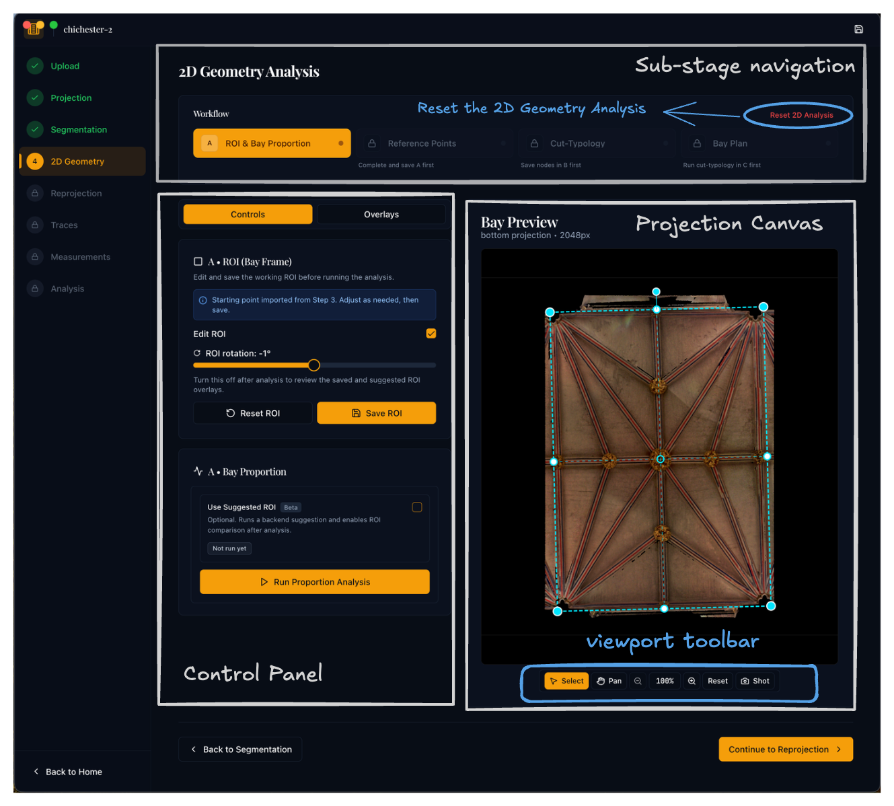
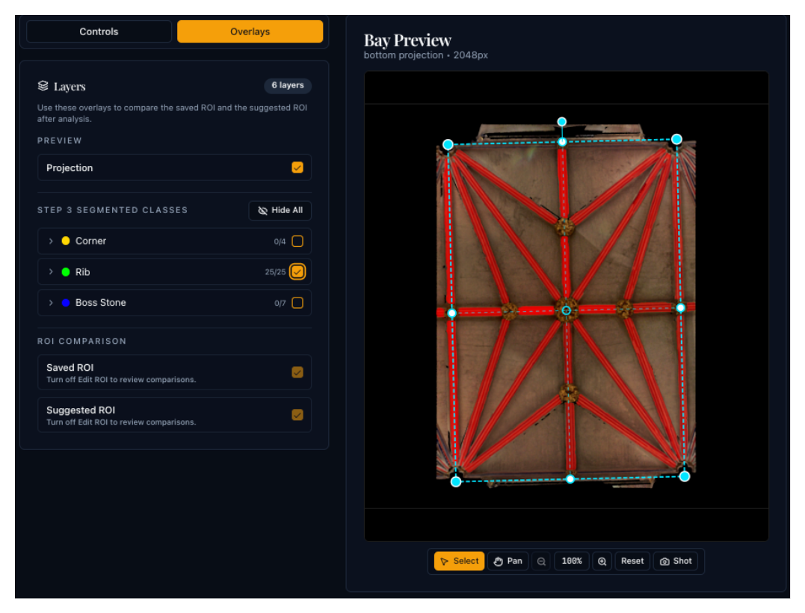

# Step 4: 2D Geometry Analysis

## Purpose

This step performs the main two-dimensional geometric interpretation of the segmented vault data. It takes the projection image and segmentation masks produced in Steps 2–3 and works towards a **bay-plan**, the network of intrados lines (rib centre-lines) that defines the vault's planimetric design.

Medieval vault plans were conceived as intersecting patterns of ribs, laid out through iterative geometrical operations on a rectangular bay.[^1] Vault Analyser replicates this logic computationally: it establishes the bay rectangle, locates the bosses (rib junctions), tests which geometric template best explains their positions, and reconstructs the rib network.

[^1]: For background on medieval vault-plan geometry see [Plans — Tracing the Past](https://www.tracingthepast.org.uk/2021/04/07/designing_plans/).

## Sub-stages

2D Geometry Analysis consists of four sequential sub-stages, labelled **4A–4D** in the interface:

| Sub-stage | Name | Key action |
|-----------|------|------------|
| **4A** | [ROI and Bay Proportion](roi-and-bay-proportion.md) | Define the analysis region and compute the bay's aspect ratio |
| **4B** | [Reference Points](reference-points.md) | Review and adjust the boss and corner nodes used by later stages |
| **4C** | [Cut-Typology Matching](cut-typology-matching.md) | Score each boss against starcut and circlecut templates to identify the best-fit design typology |
| **4D** | [Bay-Plan Reconstruction](bay-plan-reconstruction.md) | Infer the rib network as a graph of nodes and edges |

## Sub-stage dependencies and staleness

The sub-stages run in sequence and feed one another, so each one works from the **saved** output of the stages before it:

- **4C** matches against the saved ROI (4A) and the saved reference points (4B).
- **4D** reconstructs from the saved ROI, the saved reference points, and the saved 4C matching result.

Because each stage reads its *saved* inputs, work in progress does not disturb the later stages until you save it. For example, dragging or editing reference points in 4B has no effect on 4C or 4D until you click **Save Reference Points**.

If you change an earlier stage after a later one has already run, the later stage is marked as out of date. Its chip in the workflow stepper shows an amber dot and an **"Update needed"** note with a **Dismiss** link. You then have two choices:

- **Run the stage again** so that it picks up the new inputs, or
- **Dismiss** the note, which marks the stage as up to date without running it again. Use this when you know the change does not affect the result.

A result that was produced before this tracking existed is also marked, so you can run it once to set a baseline. There is deliberately no link from the ROI back to 4B: reference points are fixed pixel positions that a change to the ROI does not invalidate, and the ROI corner anchors are refreshed by the 4A analysis instead.

### Stepper dot colours

| Dot | Meaning |
|-----|---------|
| Amber dot | **Update needed**: an earlier step changed, so run this stage again or dismiss the note |
| Emerald | Stage complete and up to date |
| Amber (current) | The stage you are working on |
| Grey | Locked: an earlier stage must be completed first |

## Interface layout

{ width="700" .center }

### Overlays panel

Across Step 4, the **Overlays** tab opens the **Layers** panel so you can turn the projection, segmentation classes (e.g. ribs, bosses, corners), and ROI comparisons on or off over the canvas. It is shared between sub-stages and helps you check masks and saved geometry against what you see on the image while you adjust the ROI, points, matching, or bay plan.

{ width="500" .center }

## Key concepts

**ROI (Region of Interest)**
:   A rotatable rectangle that isolates one vault bay on the projection image. Later geometry is measured relative to this frame.

**Boss**
:   A raised keystone or junction where ribs meet. Bosses are represented as point nodes for later matching and reconstruction.

**Cut typology**
:   The family of geometric templates used to explain boss positions within the bay.

**Bay plan**
:   The final graph of nodes and edges representing the vault's 2D rib pattern.

<!-- ## Why this step matters

This is the most interpretation-heavy part of the workflow. The bay-plan reconstruction produced here feeds directly into Step 5 (3D reprojection) and all downstream measurement and analysis steps. An accurate bay plan is essential for reliable three-dimensional rib geometry. -->

## Expected result

<!-- Before moving on to Step 5 you should have: -->

- a saved ROI with sensible bay proportions
- a reviewed set of reference points
- a credible matching result
- a reconstructed bay plan that agrees with the visible rib pattern
