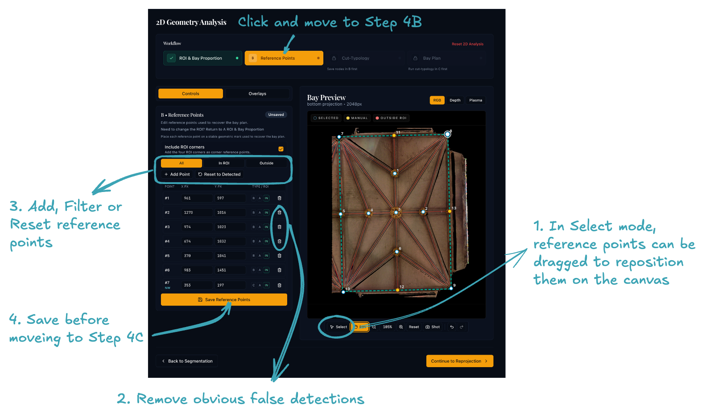

# Step 4B: Reference Points

## Purpose

This sub-stage prepares the **reference points** — boss locations and corner anchors — that later matching and reconstruction stages use as the geometric skeleton for the bay. The goal is to keep the points that best represent the bay geometry, not to place as many as possible.

## Workflow

{ width="800" .center }

1. Review the detected boss points on the canvas.
      - ROI corners are included as default. Untick the option, if it is not the case.
      - The other reference points are identified from the segmented "bosses" from STEP 3.
2. Remove obvious false detections.
3. Add or reposition points where an important boss has been missed or misplaced.
4. Save the point set before moving on.

## Before moving on

- The main bosses inside the ROI are represented.
- Spurious points outside the bay have been removed.
- Corner anchors are included only if they help the interpretation.

Click **Cut-Typology Matching** on the workflow stepper bar at the top to continue to sub-stage 4C.
