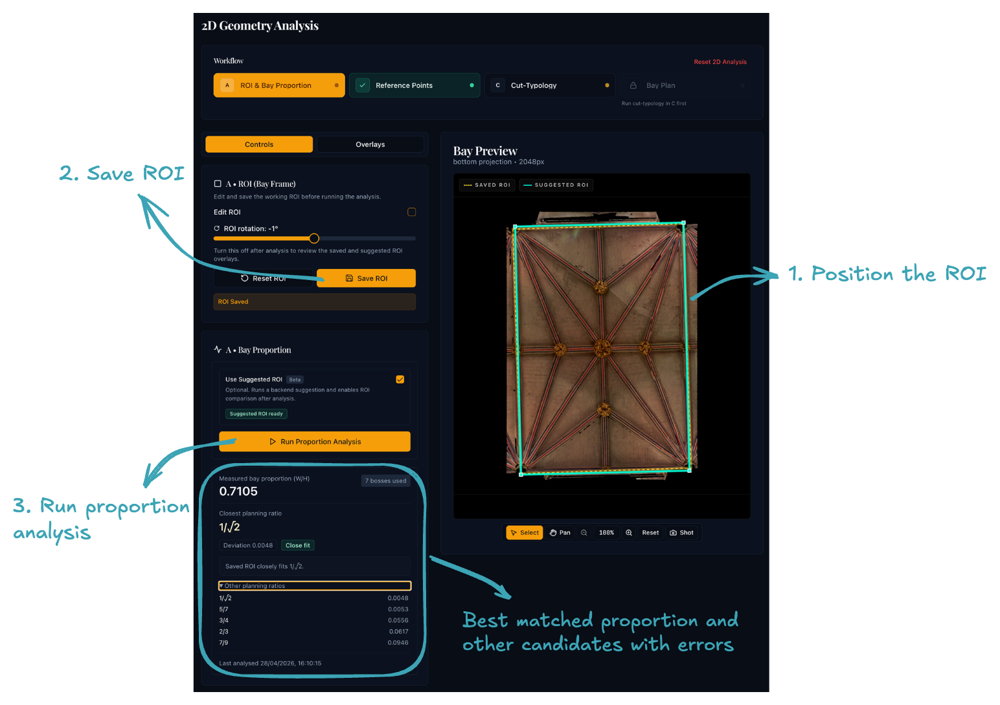

# Step 4A: ROI and Bay Proportion

## Purpose

Define the **Region of Interest (ROI)**, a rotatable rectangle that isolates one vault bay on the projection image, and establish the bay's proportional system. Everything in the later sub-stages is calculated within this rectangle.

{ width="600" .center }

## Workflow

### 1. Position the ROI

Use the interactive canvas to place the ROI over the vault bay:

- **Drag** to move the rectangle.
- **Corner handles** to resize.
- **Rotation handle** to align with the bay boundaries.

Switch to the **Overlays** tab to toggle segmentation layers (e.g. rib, boss stone) and verify the ROI encloses the correct region.

### 2. Save the ROI

Click **Save ROI**. The analysis in the next step reads from the saved ROI, so you must save before running it.

### 3. Run proportion analysis

Click **Run Proportion Analysis**. The application will:

- compute the bay's **vault ratio** (width-to-height), corrected for any distortion in the projection so it reflects the bay's true physical proportions
- rank **ratio-pattern suggestions** — the modular ratios and quadrature proportions closest to the measured value (see [Understanding the ratio suggestions](#understanding-the-ratio-suggestions) below)

### 4. Optionally auto-correct the ROI

!!! warning "Beta feature"
    Auto-correction is still under testing. Results should be reviewed carefully.

If you are unsure about the ROI placement, tick **Use Suggested ROI** and click **Run Proportion Analysis** again. This runs a grid-search over small translations, scale adjustments, and rotations to maximise alignment between detected bosses and template keypoints.

Use the **Overlays** tab to compare the saved and suggested ROI outlines. If the suggestion is not an improvement, untick **Use Suggested ROI** and re-run the analysis to revert to your manually placed ROI.

## Understanding the ratio suggestions

Medieval vault bays were set out using proportional systems to define the relationship between length and width.[^1] The ratio suggestions shown after analysis tell you which of these systems best matches the bay you are analysing:

**Modular ratios** — simple whole-number proportions such as 2:1, 3:2, 4:3, or 5:4. These are the most common; for example, the retrochoir aisles at Wells use 3:2 and the Lady Chapel at Chester uses 4:3.

**Quadrature proportions** — ratios derived from rotating a square (1:√2, 1:√3, 1:√5, etc.). The chancel at Nantwich may use 1:√2; 1:√5 proportions have been identified in the Wells transept.

**Golden rectangle** — the proportion 1:φ (1:1.618…). Widely discussed in studies of medieval architecture but not yet confirmed in any of the Tracing the Past case-study vaults.

You do not need to select a ratio manually — the suggestions are informational. The measured vault ratio is carried forward automatically into the cut-typology matching stage.

[^1]: For a detailed account of medieval proportional systems see [Measurements and Proportions — Tracing the Past](https://www.tracingthepast.org.uk/2021/04/09/designing_medieval_vaults_measurements_proportions/).

## Before moving on

You should have:

- a saved ROI that cleanly encloses the bay
- a vault ratio and ratio-pattern suggestions consistent with the visible evidence

Click **Reference Points** on the workflow stepper bar at the top to continue to sub-stage 4B.

