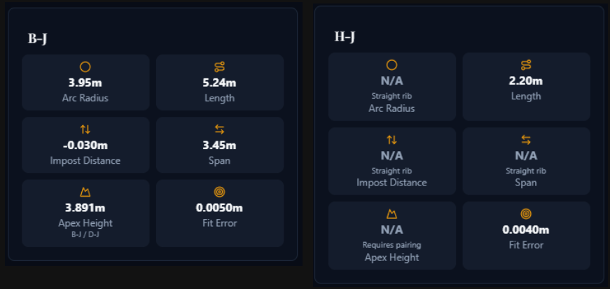
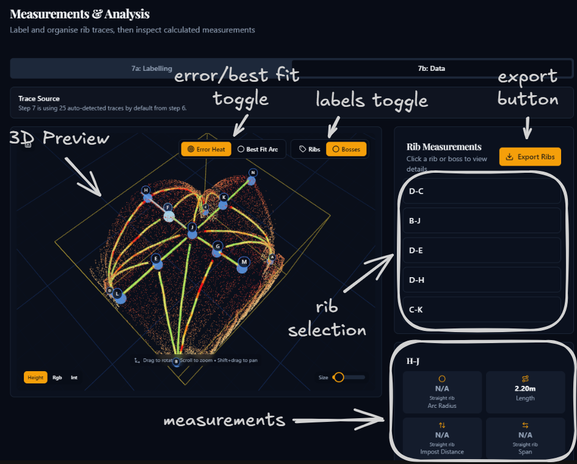

# Step 7B: Data

## Purpose

This sub-stage is the read-only measurement review for Step 7. Once the naming, grouping, and pairing logic from Step 7A has been set, the app presents the rib and boss results as a structured dataset that can be checked, compared, and exported before the final analysis in Step 8.

## What is calculated

Each rib or rib group is summarised through the following metrics:

| Measurement | Description |
|-------------|-------------|
| **Arc radius** | Radius of the best-fit circular arc, when the rib is not effectively straight |
| **Length** | Measured length of the rib trace or grouped rib system |
| **Impost distance** | Height difference between the rib's fitted arc centre and the chosen impost line |
| **Span** | Horizontal measure derived primarily from boss/apex logic and rib pairings; an experimental semicircular mode is also available |
| **Apex height** | Height above impost line derived primarily from rib pairings; an experimental semicircular mode can also supply it for flagged groups |
| **Fit error** | Residual error of the arc fit, used as a quality check |

Boss stones are also summarised, including their height above the impost line when enough apex information is available.

The measurement tiles can show different states depending on the rib geometry. The example below shows the expected values for one regular curved rib and one straight rib, where some arc-based measurements become unavailable or not applicable.

## Workflow

### 1. Review the measurement list

- The **Rib Measurements** panel shows all current display rows: single ribs, auto-detected groups, and manual groups.
- Multi-rib groups can be expanded to inspect their component traces.
- Click a row to inspect its detailed metrics.

### 2. Use the 3D viewer to verify the geometry

- **Error Heat** colours the rib by point-wise distance from the fitted arc. Use it to spot poor fits or local distortions.
- **Best Fit Arc** replaces the heatmap with the fitted arc geometry itself.
- Click ribs or boss labels in the viewer to jump to the corresponding details in the side panels.

### 3. Inspect the selected metrics

- The details card reports the main measurement tiles for the selected rib or group.
- A grouped selection also lists the relevant apex/boss information and the individual ribs it contains.
- Straight ribs may show some measurements as **not applicable** rather than numeric.
- Ribs without a valid pairing may show **Apex Height** as unavailable.

### 4. Review boss-stone heights

- The **Boss Stones** panel shows the current height above impost for each boss where an apex can be resolved.
- Heights may come from explicit rib pairings first, with boss-apex data used as a fallback.

### 5. Export the data if required

- **Export Ribs** writes the rib or rib-group table to CSV.
- **Export Bosses** writes the boss-stone height table to CSV.

### 6. Continue to Step 8

- Clicking **Continue to Analysis** saves a Step 7B summary snapshot for the final analysis page.

## What to look for

- groups that still combine the wrong traces
- unusually high fit errors compared with the rest of the vault
- missing apex heights caused by absent or incorrect pairings
- implausible boss heights caused by a poor impost line choice
- straight ribs being forced into curved interpretations

If the measurements do not look credible, return to Step 7A and revise the naming, grouping, pairings, or impost setup before exporting or proceeding.

Click **Continue to Analysis** to proceed to Step 8.
