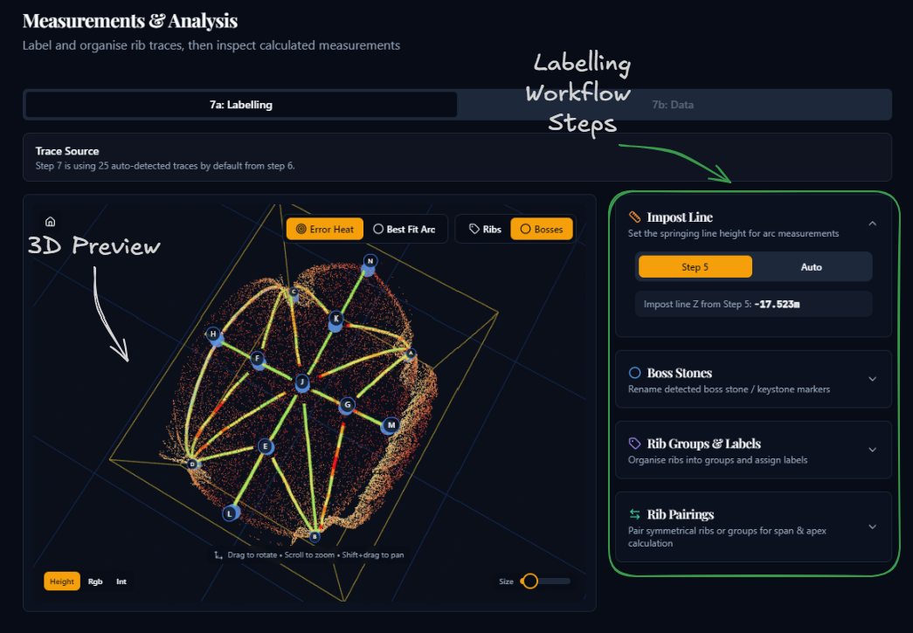
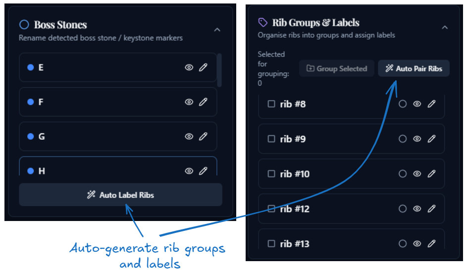

# Step 7A: Labelling

## Purpose

This sub-stage defines the interpretation rules for the measurement step. You review the rib traces loaded from Step 6, name the ribs and boss stones, decide which traces belong together, pair symmetrical ribs, and choose the impost line used for later height calculations. An additional **semicircular** flag is available as an experimental option, but it should be used cautiously.

The aim is not just to tidy the labels. The choices you make here directly affect the values shown in Step 7B, especially **span**, **apex height**, and any grouped measurements.

## Workflow

### 1. Review the trace source banner

- Step 7 can use the automatic traces from Step 6, imported manual traces, or both.
- If both are available, switch between **Auto**, **Manual**, and **Both** before doing any naming or grouping.

### 2. Inspect the 3D viewer

- Click rib labels or traces to select them.
- Use **Error Heat** to show how strongly a trace departs from its best-fit arc.
- Use **Best Fit Arc** to inspect the fitted circular arc directly.
- Toggle **Ribs** and **Bosses** to show or hide labels in the viewer.

### 3. Set the impost line

- In the **Impost Line** panel, choose either **Step 5** or **Auto**.
- **Step 5** uses the floor-plane value already established during reprojection.
- **Auto** estimates the impost height from the springing geometry of the loaded ribs.
- If Step 5 did not save an impost height, use **Auto** or return to Step 5.

### 4. Review boss stones

- In the **Boss Stones** panel, rename keystone and junction markers so they are meaningful for the current vault, if necessary.
- Use the eye icon to hide distracting markers in the 3D view.
- Click **Auto Label Ribs** if you want the app to generate rib names from the nearest lower and upper boss stones. This is a useful starting point, but it still needs review.

### 5. Organise rib groups and names

- In **Rib Groups & Labels**, select ribs and click **Group Selected** when multiple trace segments should be treated as one structural rib.
- Rename individual ribs or whole groups where needed.
- Use **Ungroup** on an automatic or manual grouping if the app has combined the wrong traces.
- Mark ribs or groups as **semicircular** only if you deliberately want to test the experimental semicircular mode.
- In most cases, it is better to treat semicircular rib sets like any other ribs: name them, group them if needed, and define the relevant pairings normally.

### 6. Define rib pairings

- In **Rib Pairings**, select exactly two ribs or rib groups and click **Pair Selected** to define a symmetrical pair.
- Use **Auto Pair Ribs** to let the app propose missing pairings from boss-symmetry analysis.

The **Auto Label Ribs** and **Auto Pair Ribs** actions are best used as a first pass: they can speed up setup considerably, but you should still review the generated names and pairings before continuing.

### 7. Continue to Step 7B

- Clicking **Continue to Data** saves the current configuration and unlocks the data tab.

## Before moving on

- the correct trace source is selected
- the impost line height has been reviewed
- important boss stones have clear names
- ribs that belong together have been grouped
- incorrect automatic groupings have been removed
- symmetrical ribs have been paired where apex comparison is needed

Click **Continue to Data** at the bottom of the page to continue to sub-stage 7B.
