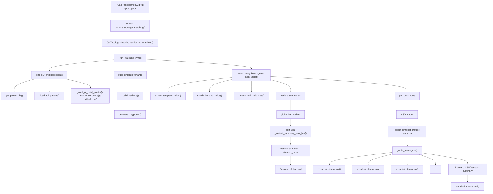

# Geometry2D Stage-2 Template Matching Design

## Goal
Implement Step 4 Stage-2 (Template Matching) after ROI analysis, with editable boss points, tunable matching parameters, and overlay of multiple template variants (standardcut grids + circlecut templates).

## Constraints
- Do not import from `backend/vault_geometry2d/*`.
- Duplicate and adapt Step04 matching logic under:
  - `backend/services/geometry2d/*`
  - `backend/routers/geometry2d.py`
- Keep frontend wiring aligned with current Step-4 architecture:
  - `useStep4Geometry2DController`
  - `Geometry2DInspectorPanel`
  - `ProjectionCanvas`

## Backend Architecture
### New service
- File: `backend/services/geometry2d/template_matching_service.py`
- Responsibilities:
1. Load base boss points from `2d_geometry/boss_report.json`.
2. Persist user-editable boss points in `2d_geometry/template_matching/boss_points.json`.
3. Run matching for selected variants and parameters.
4. Build overlay-ready template geometry and matching outputs.

### Data files
- `2d_geometry/template_matching/boss_points.json`
  - Canonical editable points (numbered labels used as IDs).
- `2d_geometry/template_matching/matching_result.json`
  - Last run configuration, variant summaries, per-boss matches.

### New router endpoints
In `backend/routers/geometry2d.py`:
- `GET /template/state`
  - Returns points + defaults + saved params + last result summary.
- `POST /template/state`
  - Saves edited/added points.
- `POST /template/run`
  - Executes matching and returns result including overlay primitives.

## Matching Algorithm Design
### Candidate variants
- Starcut standard grid variants: `n = [starcutMin .. starcutMax]`.
- Circlecut variants: `inner`, `outer`.
- Optional cross templates: x-ratios from one variant, y-ratios from another.

### Core matching rule
Per boss `(u, v)`:
- Find nearest x-ratio and y-ratio in selected template(s).
- A boss matches a variant iff both distances <= tolerance.

### Outputs
- Per variant:
  - `matchedCount`, `coverage`, `matchedBossIds`
- Per boss:
  - `matchedAny`, `matches[]` with ratio indices/errors
- Best variant:
  - Highest `matchedCount` (tie -> stable order)

## Frontend Architecture
### API layer
- Extend `src/lib/api/geometry2d.ts` with typed contracts for template-state and template-run endpoints.

### Controller state additions
In `useStep4Geometry2DController`:
- Boss points list (editable, numeric labels).
- Template params and toggles.
- Selected overlay variants (multi-select).
- Load/save/run handlers.

### Template panel
Replace staged placeholder with:
1. Boss point editor (x,y,label, add/remove optional points).
2. Parameter controls for matching algorithm.
3. Run button + status/result summary.
4. Overlay variant selector (multi-template overlap).

### Projection overlay
`ProjectionCanvas` overlays:
- Numbered boss points.
- Template lines/points for selected variants.
- Existing ROI/intrados overlays remain unchanged.

## Consistency Notes
- Persist stage data under `steps[4].data.geometry2d` (existing pattern).
- Keep small focused service modules in `backend/services/geometry2d`.
- Use existing UI primitives (`Card`, `Input`, `Checkbox`, `Button`, `Slider`, `Badge`) and current layout split.


```
